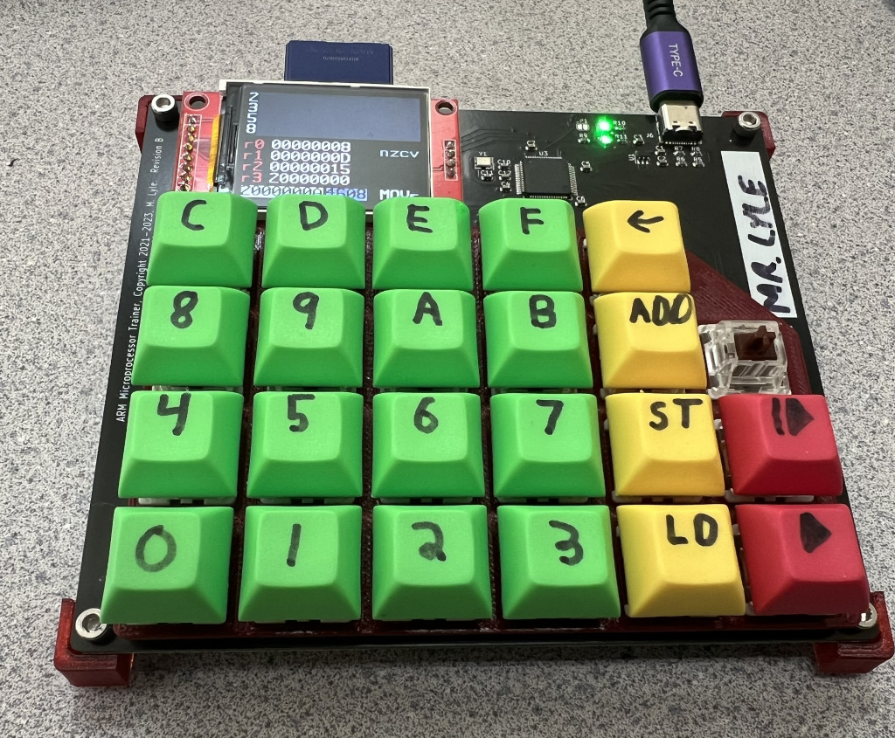

# ARM Trainer

This is a minimal monitor and and hardware stack for a small microcontroller trainer board, that was used to teach a Computer Organization class to students from ages 11-14.

Microprocessor trainers were a commonplace tool used to learn computing in the 1970s and early 1980s.  They replicated the console found on minicomputers, and allowed engineers to gain experience writing programs in machine code.

The Computer Organization class that I taught was a "how computers work" class with minimal use of conventional computers in the classroom.  We focused initially on gates, building from there to understand simple combinatorial and sequential circuits, and eventually ALUs, register files, and microprocessor subsystems.  This culminated in a study of ARM-Thumb machine code.

ARM-Thumb machine code was a fairly ideal architecture for students to learn, because:

* It is a real architecture, in real use.
* It has a reasonable number of general purpose registers.
* A fixed-length, relatively simple encoding avoids unnecessary complexity.

## Example Program

By a student, Robin K:

    20000000	DF20		(clear screen)
    20000002	2001		(mov r0, #1)
    20000004	2102		(mov r1, #1)
    20000006	180A		(add r2, r0, r1)
    20000008	DF21		(print contents of register 0)
    2000000A	4608		(mov r0, r1)
    2000000C	4611		(mov r1, r2)
    2000000E	E7FA		(b 20000006)

## TODO

* Students have complained that some invalid instructions-- BBAD, EF78-- seem to lock up the machine monitor.  I think I removed some safeguard code that I didn't think was necessary, but I need to inspect that again.
* Relative branches were difficult for students to compute.  Finding a better way to explain this, in both lessons and manuals, would be helpful.  There was a slight improvement this year but it's hard.
  * It doesn't help that I don't teach the students two's complement for signed notation, but there's already *so much* in the course for 10 weeks.
  * Maybe I can add a branch calculator function to the monitor.
* The screen needs to clearly show that code is running.
* Input calls do not allow the user to enter the number "0".
* Add a help key showing key shortcuts?
* The manual should be updated with some of the system calls that have not been documented
  * In particular, the input calls.
  * There may be a typo in the subtract register instruction.
* The display icon and screen coordinate system could be more clearly explained
* Overall curriculum, etc, should get posted here.
